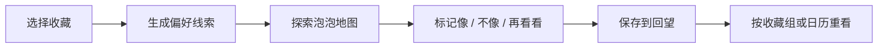

# 藏见 CANGJIAN

> 从收藏里，看见自己。

**藏见**是一个把零散收藏转化为「偏好线索」的 AI 产品原型。它不替你定义风格，而是从反复保存的图片、标题与文字中，找到那些值得被看见的共同点。

[查看 Live Demo →](https://cangjian-ai-design.onrender.com)


## 核心体验

从一组收藏开始，藏见会寻找反复出现的偏好线索，并把它们呈现在一张可探索、可被修正的地图里。

| 页面 | 它在做什么 |
| --- | --- |
| 首页 | 说明藏见如何从收藏里发现偏好，并引导用户开始体验。 |
| 收藏 | 选择一组想重新理解的收藏，组成一次看见的起点。 |
| 看见 | 用泡泡地图呈现收藏、偏好线索与它们之间的联系。 |
| 回望 | 保存每次看见，并按收藏组或日历重新打开。 |

## 使用流程



## 功能

- 从一组收藏中提炼有证据支撑的偏好线索
- 用可探索的泡泡地图呈现收藏之间的关联
- 点击泡泡查看支持该判断的具体收藏
- 对每条线索分别标记「很像我 / 不太像我 / 再看看」
- 保存分析结果，并在「回望」中按收藏组或日历重新查看
- 未配置 AI 服务时，仍可使用本地演示规则体验完整流程

## 设计推导与迭代

### 从“分类”转向“理解”

收藏不应该被简单归进某一种风格。藏见关注的是反复出现的选择：你为什么会保存它，它和其他喜欢之间有什么联系。因此，每条偏好线索都必须能回到具体收藏中找到依据。

### 用泡泡地图代替结论列表

偏好之间并不是线性的。泡泡地图让收藏、线索与关联同时出现，用户可以从任意一个泡泡开始探索，而不是被迫接受一份固定结论。

### 把判断权留给用户

“很像我 / 不太像我 / 再看看”不是评分系统，而是让用户保留对自己偏好的解释权。每个泡泡都可以独立反馈，不会锁住其他线索。

### 让结果能够被回望

分析不应该是一次性消耗。藏见将每次看见保存到当前浏览器中，用户可以回到过去的收藏组，重新理解当时的偏好。

## 技术实现

| 模块 | 方案 |
| --- | --- |
| 前端 | React 19 + Vite + TypeScript |
| 动效与图标 | Framer Motion + Lucide |
| 后端 | Node.js + Express |
| 数据校验 | Zod |
| AI 分析 | Agnes API；未配置时自动使用本地 DemoProvider |
| 历史记录 | 浏览器 localStorage |

## 本地运行

需要 Node.js 22 或更高版本。

```bash
npm install
cp .env.example .env
npm run dev
```

打开 [http://127.0.0.1:5173](http://127.0.0.1:5173)。

## 配置 AI 分析

在 `.env` 中配置服务端环境变量：

```bash
AGNES_API_KEY=
AGNES_BASE_URL=https://apihub.agnes-ai.com/v1
AGNES_TEXT_MODEL=agnes-2.0-flash
PORT=3001
```

- 不配置 `AGNES_API_KEY`：应用使用本地演示分析。
- 配置后：由 Express 服务端请求 Agnes API。
- 请勿将 API Key 提交到 GitHub，也不要使用 `VITE_` 前缀暴露它。

## 测试与生产构建

```bash
npm test
npm run build
npm start
```

`npm start` 同时提供构建后的前端页面与 `/api` 服务。

## 部署

项目包含 Express API，不适合 GitHub Pages。推荐部署到 Render 或 Railway：

| 设置 | 值 |
| --- | --- |
| Build Command | `npm install && npm run build` |
| Start Command | `npm start` |
| Node 版本 | 22+ |

前端和 `/api` 由同一个 Express 服务提供，因此无需单独配置跨域，也不会把 API Key 暴露给浏览器。

## 项目结构

```text
src/       React 页面、泡泡地图与本地回望记录
server/    Express API 与 AI Provider
shared/    输入、输出和证据校验规则
tests/     分析、布局与历史记录测试
```

## 图片说明

示例图片仅用于演示界面与收藏关系，不代表真实用户数据。部分图片来自 Unsplash，部分为 AI 生成的室内场景；每条示例收藏均对应不同图片。

## 作者

Ruiying Liu
